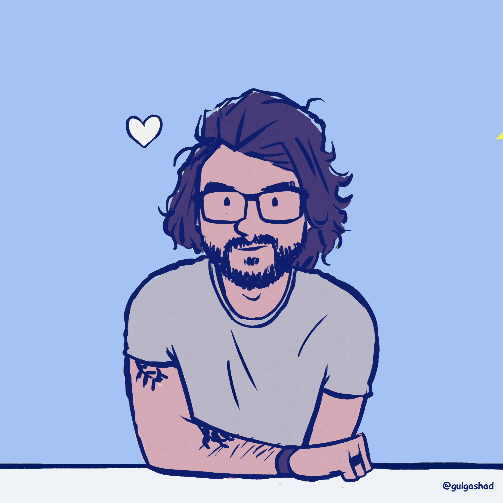
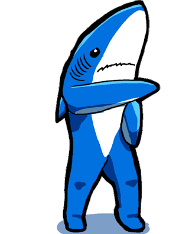
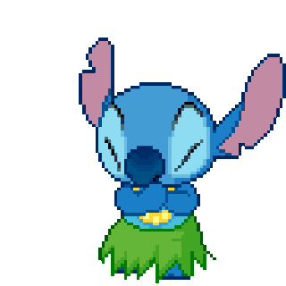

<h2> Olá, eu sou Rahel!  </h2>

💚 Hoje sou Instrutor do Módulo de *Ciencia da Computação na [Trybe](https://github.com/betrybe)!*.
> _Aplicando **Python**, Algoritmos, Redes e Estruturas de Dados;_

👾 Game Dev nas horas vagas!
> _Alguns anos aprendendo e desenvolvendo jogos indie na **Unity** com C#;_

🐝 Codando na [Arapuá]([https://github.com/betrybe](https://github.com/arapua))
> _Apaixonado por novas tecnologias;_

🎓 Graduado e Mestre em Ciência da Computação
> _Summa Cum Laude;_

<h2> Connect/Contact me  </h2>

<h2> Stats for those love  </h2>

  <a href="https://github.com/irahel">
  
  

<h2> I code with  </h2>

>

  
  
  

<!-- future:
https://img.shields.io/badge/Itch.io-FA5C5C?style=for-the-badge&logo=itchdotio&logoColor=white
https://img.shields.io/badge/Game%20Jolt-CCFF00?style=for-the-badge&logo=Game%20Jolt&logoColor=white
 --->

<!--

    

-->

<!--

  

-->
